# 🚀 iPhone 15 Pro Animated 3D Website Clone (Performance Showcase)

## **STRATEGIC ARCHITECTURE & BUSINESS VALUE**

### 🎯 Identified Market Problem & Value Proposition

> **Core Problem:** The technical challenge of delivering cutting-edge web capabilities (3D rendering, complex scroll animations) while simultaneously maintaining high performance and responsiveness across all devices.
>
> **T-Shape Solution:** Recreated a highly complex industry benchmark (Apple's iPhone 15 Pro page) using **Three.js and GSAP** to deliver an immersive, high-impact user experience, proving advanced mastery of web animation and **Technical Optimization**.

### 📈 Key Metrics, Anti-AI Strategy, and Business Alignment

*   **Performance Priority:** Extreme focus on **FCP/LCP** and performance monitoring (**Sentry**) to ensure the smooth rendering of heavy 3D assets and animations.
*   **Strategy Anti-AI:** The core value lies in **creative direction, advanced maquetación, and optimization** of heavy assets (3D models). This requires human judgment and meticulous tuning of **GSAP/Three.js** to achieve aesthetic results without performance degradation.
*   **Monetization/Value Stream:** Directly showcases **high-quality Front-End architectural design and implementation** to attract high-value contracts focused on branding and digital presence.

---

## **DEEP SOFTWARE ARCHITECTURE**

### 🛠️ Core Technology Stack

| Technology | Role and Strategic Justification |
| :--- | :--- |
| **Framework** | ReactJs / Vite |
| **Backend/DB** | None (Static Asset Hosting) |
| **Styling** | Tailwind CSS |
| **Authentication** | None |
| **AI/Services** | Three.js, GSAP, Sentry |

### ⚙️ Key Architectural Decisions

1.  **React/Vite:** Chosen for component-based efficiency and rapid development cycles.
2.  **Three.js & GSAP:** Utilized to manage complex **3D rendering** and precise **scroll-based animations**, demonstrating specialized expertise beyond standard Front-End development.
3.  **Sentry:** Integrated for **error tracking and performance monitoring**, crucial for ensuring stability in a highly animated, resource-intensive environment.
4.  **Technical Optimization:** Meticulous state management and lifecycle hooks were necessary to synchronize scroll events with complex 3D scene rendering.

---

## **T-SHAPE SUPERPOWERS & EXECUTION CHALLENGES**

### 🧠 Strategic Challenges Overcome

*   **Challenge 1:** Synchronizing complex **GSAP scroll animations** with the rendering of heavy **Three.js 3D models**.
*   **Solution 1:** Custom throttle and debounce mechanisms were implemented to optimize the relationship between the scroll position and the 3D scene state.
*   **Challenge 2:** Preventing performance degradation and dropped frames (jank) on mobile devices due to complex animations.
*   **Solution 2:** Aggressive optimization of asset loading and use of performance monitoring tools (**Sentry**) to catch and eliminate bottlenecks.

### 💻 Local Setup (Quick Start)

```bash
# 1. Clone repo
git clone https://github.com/saulkurosaki/APPLE-WEBSITE-CLONE

# 2. Install dependencies
cd APPLE-WEBSITE-CLONE
npm install

# 3. Configure Environment Variables
# No .env.local file needed for this project.

# 4. Start Development Server
npm run dev
```
---


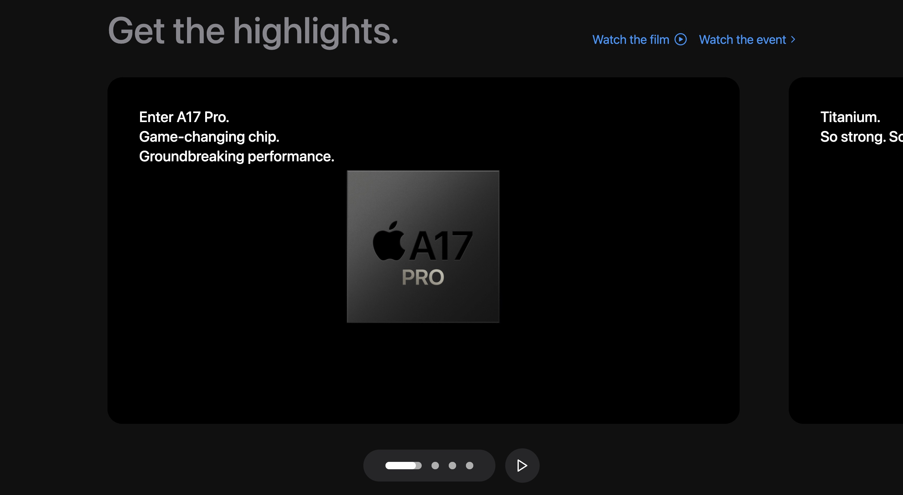
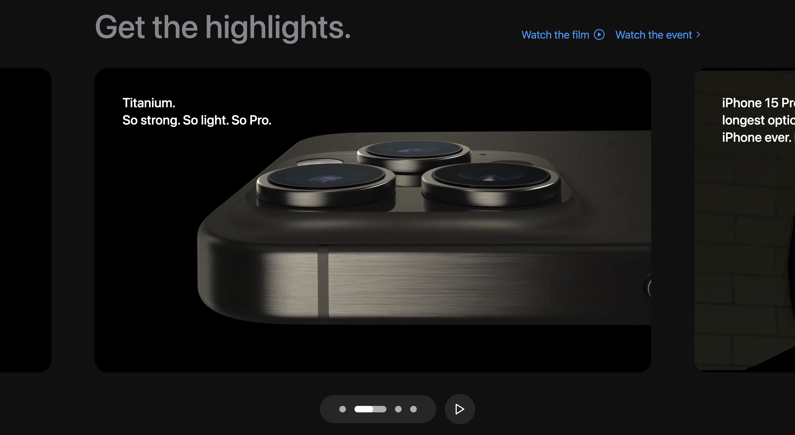
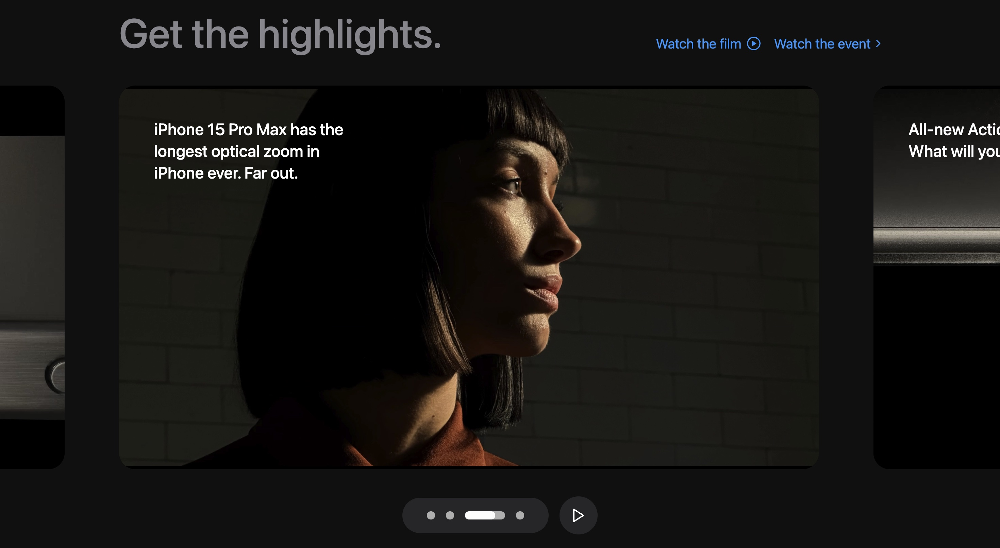


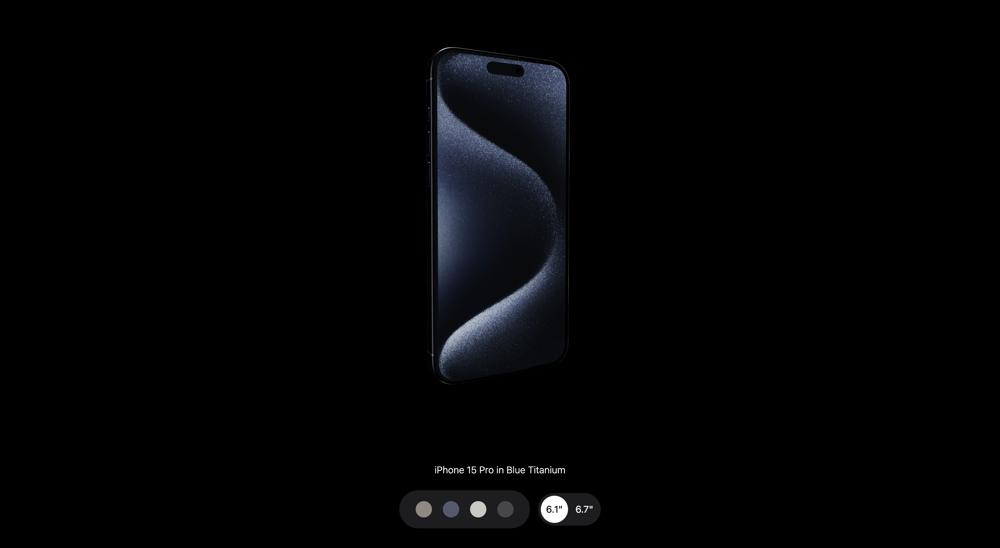


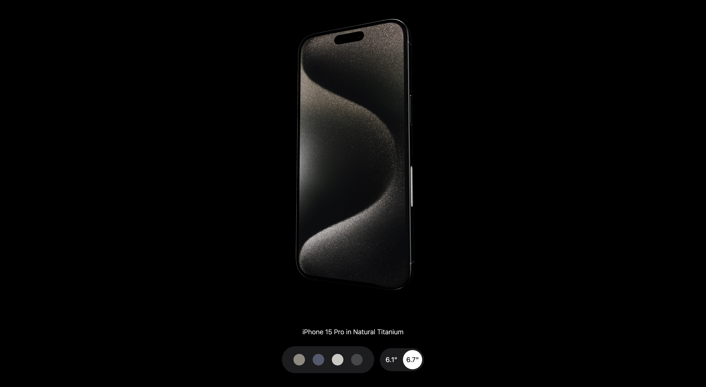
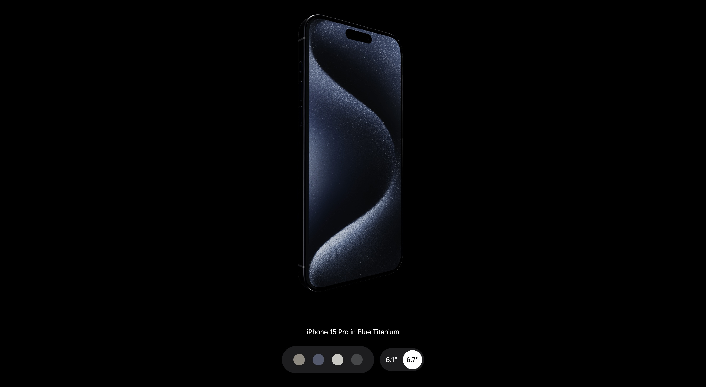
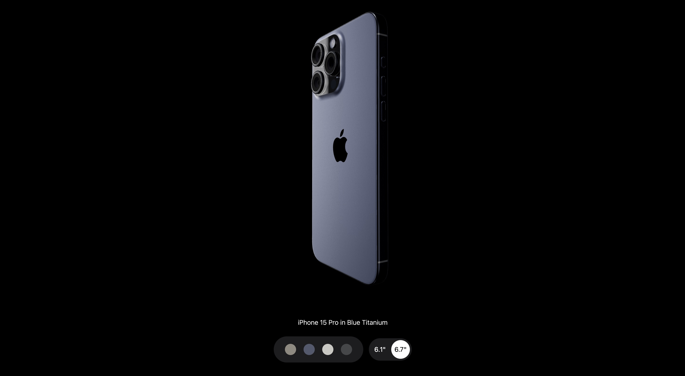

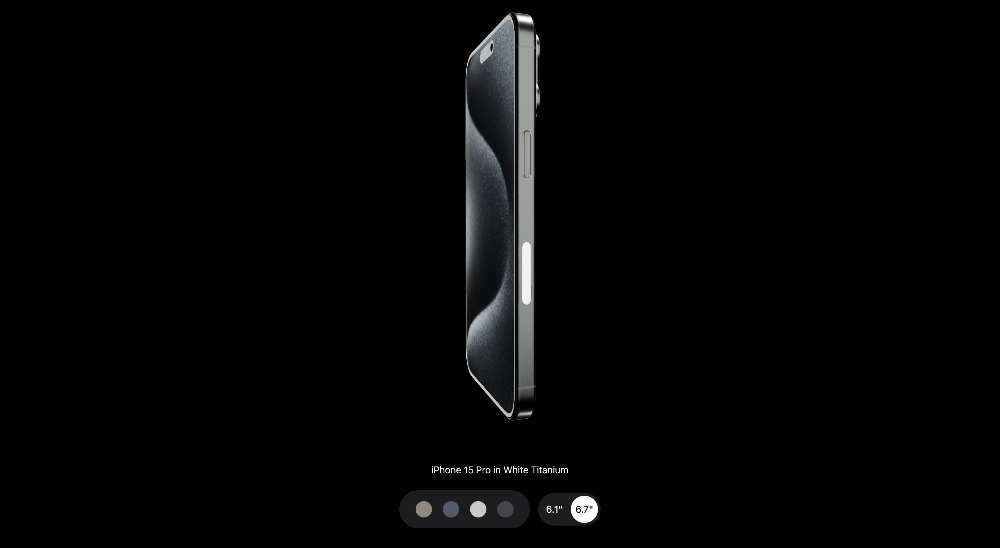


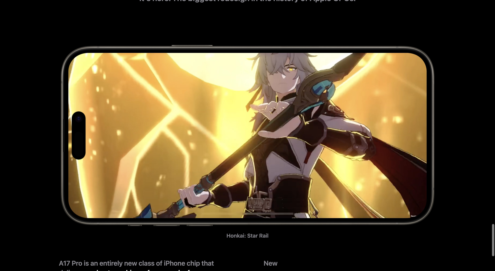
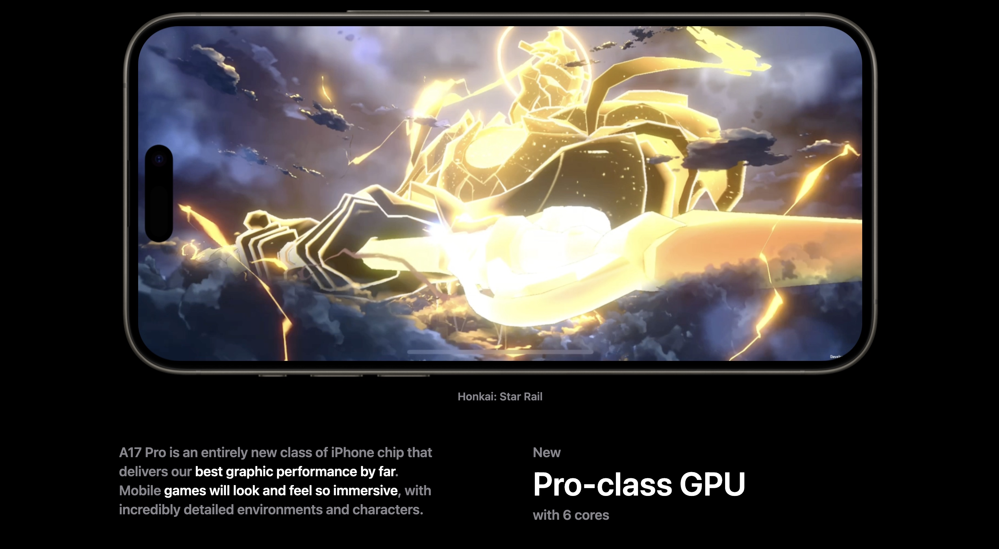

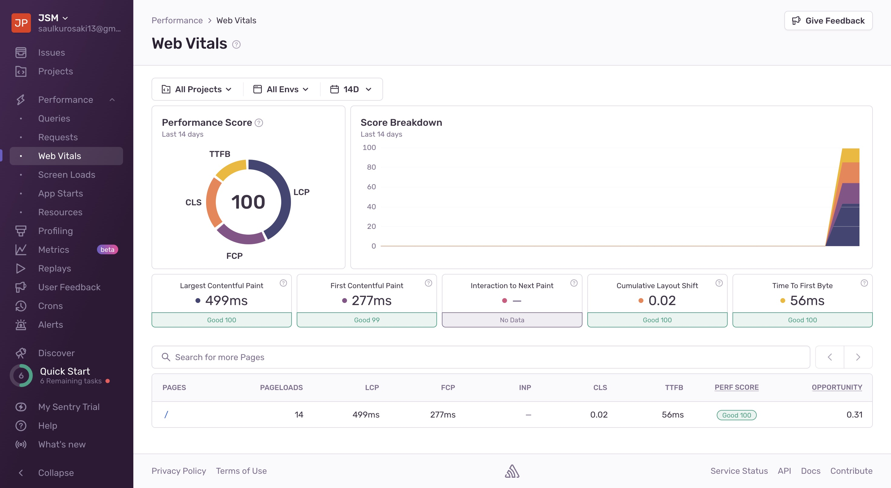


